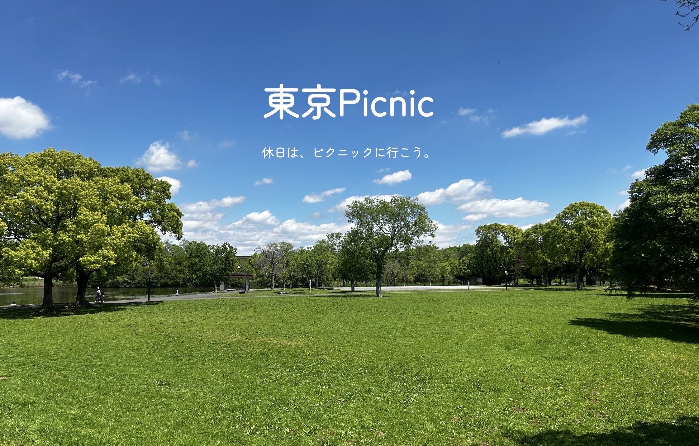

## サービス名
### [東京picnic](https://tokyopicnic.com/)
ログインをしなくても公園の検索や公園の詳細情報をご確認いただけます。 

## サービス概要
- 東京23区にある、ピクニック可能な公園を検索できる
- ユーザーが公園情報を投稿し共有する
- 公園を通して、行ったことのない土地に行ってみるきっかけを提案する

## このサービスへの思い・作りたい理由
- 私自身、キャンプなどのアウトドアに興味はあるけど、ハードルが高く、都内にいながら手軽に自然も非日常も手に入れたいと思った時、友人と公園を巡り始めました。 
- ピクニックができる公園を探すとき、アクセスの良さ・有料か・飲酒はできるか・シートは広げられるかなどを考慮して公園を決定するのが大変で、目的別で公園を検索できる方法があればいいと思ったことがアプリ作成のきっかけです。 
- また、私は東京に生まれ育ち、東京という街が好きなのですが、行ったことがない場所はたくさんあります。 
　行ったことがないだけで、魅力のある場所というのはたくさんあるはずという思いと、ずっと暮らしている割に土地勘がないという悔しさがあり、東京23区を制覇するという目的を持たせたアプリにしたいと思いました。 
- アクセスの良さを考慮すると、普段は行こうとはならない場所にも、公園を通して訪れるきっかけ作りになったら良いと思っています。 

## ユーザー層について
- 東京に暮らす人
- 休日はゆっくりと過ごしたいと思っている人

## 機能紹介
### ユーザー登録せずできること
|トップページ|公園検索|
|:----------|:----------|
|||
|押すたびにランダムで異なる公園を紹介するボタンを設置しました。公園の詳細と検索ページのリンクも設置することで、公園を探すための導線をまとめました。|条件で公園を絞り込み検索できます。GooglemapのJavaScript APIを使用することで、現在地に近い公園についても地図上で確認できるようにしました。|

|公園詳細ページ(1)|公園詳細ページ(2)|
|:----------|:----------|
|||
|公園詳細ページでは、公園情報の確認ができ、公式サイトに飛ぶこともできます。|GoogleのMaps Embed APIを使用しているので、ここから拡大地図にてルートの確認も行えます。|

### ユーザー登録するとできること
|ログイン機能|マイページ|
|:----------|:----------|
|||
|ユーザー登録・ログインが手軽に行えるよう、Googleログイン機能を実装しました。|マイページから、ユーザー情報の変更と自身の投稿一覧、ブックマークした公園が確認できます。|

|新規投稿|23区の達成を可視化|
|:----------|:----------|
|||
|公園の日記を投稿することで、思い出が残せます。既にデータベースにある公園に関しては予測変換機能を実装し、区が自動補完されます。データにない公園は、公園名と区を選択することで、新規に公園のページを作成することができます。|公園日記一覧ページから、23区の行ったことがある区を確認できます。また、行ったことがない区の公園をすぐに探せるよう、区のカードをクリックするとその区の公園の検索結果が表示されます。|

### サービスの差別化ポイント・推しポイント
- ピクニックに特化した公園のサービスである。
- Googlemapでは、ある程度範囲を決めた中での公園検索しかできないので、新たな土地の開拓はしづらい。
- 公園の検索の仕方として、飲酒可・シート可・区の選択などのあらかじめ用意したタグでの検索方法を提供することで、ユーザーの目的に合う情報を絞った検索ができる。

### 技術スタック
|カテゴリ|技術|
|:----------|:----------|
|フロントエンド|Tailwind CSS, DaisyUI, Turbo-Rails, Stimulus-Rails|
|バックエンド|Ruby 3.2.3, Ruby on Rails 7.1.3|
|データベース|PostgreSQL|
|認証|Devise, OmniAuth|
|インフラ|Render, Amazon S3|
|API|Google Places API, Google Maps Embed API, Google Maps JavaScript API |
|その他|MiniMagick, Ransack, CarrierWave|

###  画面遷移図
https://www.figma.com/file/jT1IMXubZj3C5haz9rBoeb/%E6%9D%B1%E4%BA%ACpicnic?type=design&node-id=0%3A1&mode=design&t=8BcDOFxaTVPNVXRy-1

### ER図
